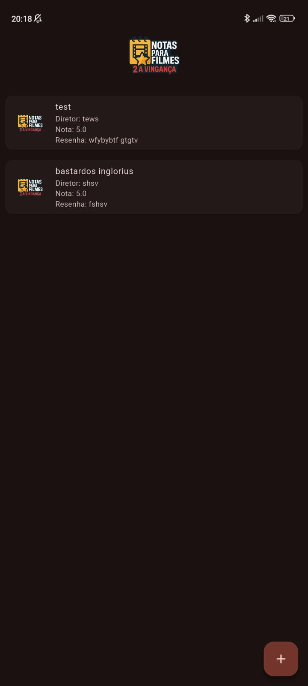
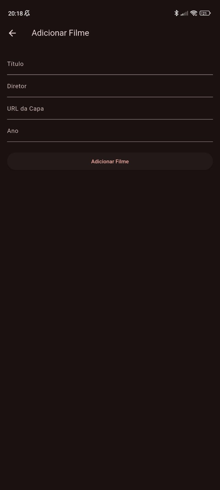
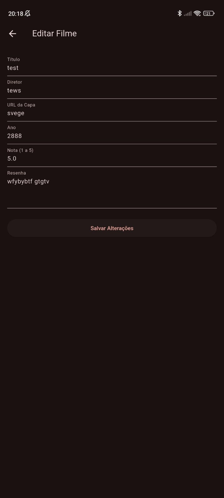
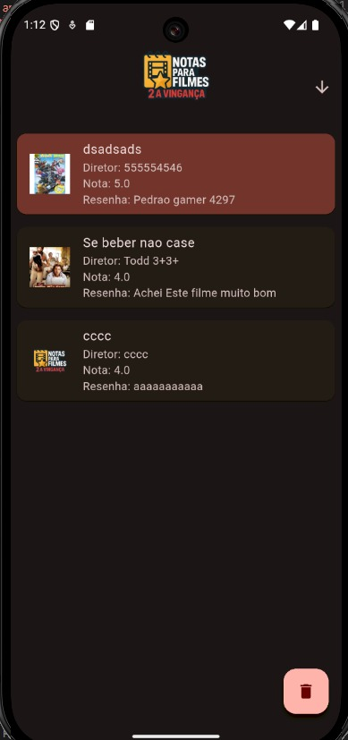
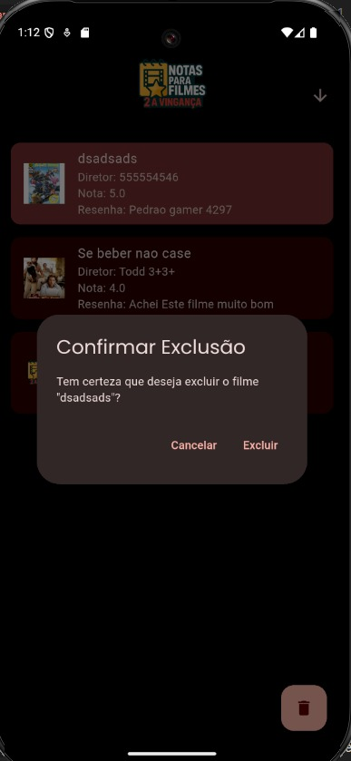

# Filme Nota Prova 🎥

Um aplicativo Flutter para gerenciar filmes e suas avaliações, permitindo adicionar, editar, excluir e visualizar filmes com notas e resenhas.

## Funcionalidades

- 📋 **Listagem de Filmes**: Exibe uma lista de filmes com título, diretor, nota e resenha.
- ➕ **Adicionar Filmes**: Permite adicionar novos filmes com título, diretor, ano e URL da capa.
- ✏️ **Editar Filmes**: Atualize informações de filmes existentes, incluindo notas e resenhas.
- 🗑️ **Excluir Filmes**: Remova filmes da lista com confirmação.
- 🌟 **Ordenação**: Ordene os filmes por nota de forma ascendente ou descendente.
- 🌐 **Carregamento de Imagens**: Suporte para carregar imagens de URLs.

## Estrutura do Projeto

```
lib/
├── main.dart                # Arquivo principal do aplicativo
├── pages/
│   ├── home_page.dart       # Tela inicial com a lista de filmes
│   ├── add_filme.dart       # Tela para adicionar novos filmes
│   ├── edit_filme.dart      # Tela para editar filmes existentes
├── db/
│   ├── filmes.dart          # Banco de dados para filmes
│   ├── notas.dart           # Banco de dados para notas e resenhas
└── shared/
    ├── images/              # Imagens compartilhadas
```

## Tecnologias Utilizadas

- **Flutter**: Framework para desenvolvimento multiplataforma.
- **SQLite**: Banco de dados local para armazenar filmes e notas.
- **Dart**: Linguagem de programação utilizada no Flutter.

## Como Executar o Projeto

1. Certifique-se de ter o Flutter instalado. [Guia de instalação](https://docs.flutter.dev/get-started/install)
2. Clone este repositório:
   ```bash
   git clone https://github.com/seu-usuario/filme-nota-prova.git
   ```
3. Navegue até o diretório do projeto:
   ```bash
   cd filme-nota-prova
   ```
4. Instale as dependências:
   ```bash
   flutter pub get
   ```
5. Execute o aplicativo:
   ```bash
   flutter run
   ```

## Configurações Adicionais

### Permissões

Certifique-se de configurar as permissões para carregar imagens de URLs:

- **Android**: Adicione `<uses-permission android:name="android.permission.INTERNET" />` no arquivo `AndroidManifest.xml`.
- **iOS**: Atualize o arquivo `Info.plist` para permitir carregamento de URLs HTTP, se necessário.

### Banco de Dados

O banco de dados é inicializado automaticamente ao executar o aplicativo. Ele utiliza SQLite para armazenar informações de filmes e notas.

## Capturas de Tela

### Tela Inicial


### Adicionar Filme


### Editar Filme


### Deletar Filme



## Contribuição

Contribuições são bem-vindas! Sinta-se à vontade para abrir issues ou enviar pull requests.

## Licença

Este projeto está licenciado sob a licença MIT. Consulte o arquivo `LICENSE` para mais detalhes.
